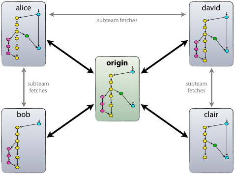
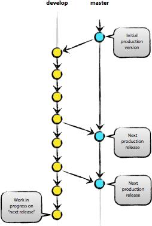
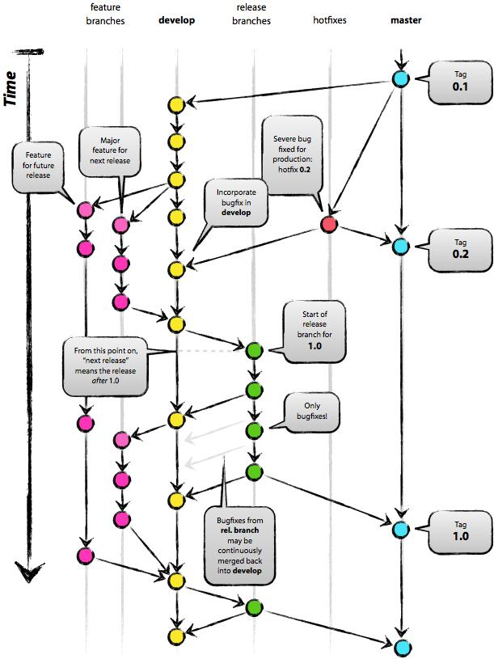
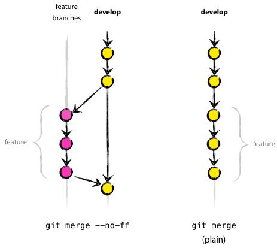
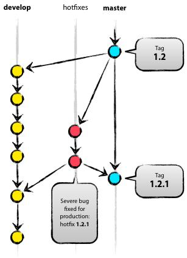

1. GIT，在技术层面上，绝对是一个无中心的分布式版本控制系统，但在管理层面上，我建议你保持一个中心版本库。

2. 我建议，一个中心版本库(我们叫它origin)至少包括两个分支，即“主分支(master)”和“开发分支(develop)”

3. 要确保：团队成员从主分支(master)获得的都是处于可发布状态的代码，而从开发分支(develop)应该总能够获得最新开发进展的代码。

4. 在一个团队开发协作中，我建议，要有“辅助分支”的概念。

5. “辅助分支”，大体包括如下几类：“管理功能开发”的分支、“帮助构建可发布代码”的分支、“可以便捷的修复发布版本关键BUG”的分支，等等。

6. “辅助分支”的最大特点就是“生命周期十分有限”，完成使命后即可被清除。

7. 我建议至少还应设置三类“辅助分支”，我们称之为“Featurebranches”，“Release branches”，“Hotfix branches”。

至此，我们形成了如下这张最重要的组织组，包含了两个粗体字分支（master/develop）和三个细体字分支（feature/release/hotfixes）。

8. “Featurebranches”，起源于develop分支，最终也会归于develop分支。

9. “Featurebranches”常用于开发一个独立的新功能，且其最终的结局必然只有两个，其一是合并入“develop”分支，其二是被抛弃。最典型的“Fearturebranches”一定是存在于团队开发者那里，而不应该是“中心版本库”中。

10. “Featurebranches”起源于“develop”分支，实现方法是：

gitcheckout -b myfeature develop

11. “Featurebranches”最终也归于“develop”分支，实现方式是：

gitcheckout devleopgit merge --no-ff myfeature（--no-ff，即not fastforward，其作用是：要求git merge即使在fast forward条件下也要产生一个新的mergecommit）（此处，要求采用--no-ff的方式进行分支合并，其目的在于，希望保持原有“Feature branches”整个提交链的完整性）gitbranch -d myfeaturegit push origin develop

12. “Releasebranch”，起源于develop分支，最终归于“develop”或“master”分支。这类分支建议命名为“release-*”

13. “Relasebranch”通常负责“短期的发布前准备工作”、“小bug的修复工作”、“版本号等元信息的准备工作”。与此同时，“develop”分支又可以承接下一个新功能的开发工作了。

14. “Releasebranch”产生新提交的最好时机是“develop”分支已经基本到达预期的状态，至少希望新功能已经完全从“Featurebranches”合并到“develop”分支了。

15 . 创建“Releasebranches”，方法是：

gitcheckout -b release-1.2 develop./bump-version.sh 1.2（这个脚本用于将代码所有涉及版本信息的地方都统一修改到1.2，另外，需要用户根据自己的项目去编写适合的bump-version.sh）git commit-a -m "Bumped version number to 1.2"

16. 在一段短时间内，在“Releasebranches”上，我们可以继续修复bug。在此阶段，严禁新功能的并入，新功能应该是被合并到“develop”分支的。

17. 经过若干bug修复后，“Releasebranches”上的代码已经达到可发布状态，此时，需要完成三个动作：第一是将“Releasebranches”合并到“master”分支，第二是一定要为master上的这个新提交打TAG（记录里程碑），第三是要将“Releasebranches”合并回“develop”分支。

gitcheckout mastergit merge --no-ff release-1.2git tag -a 1.2（使用-u/-s/-a参数会创建tag对象，而非软tag）git checkout developgit merge --no-ffrelease-1.2git branch -d release-1.2

18. “Hotfixbranches”源于“master”，归于“develop”或“master”，通常命名为“hotfix-*”

19. “Hotfixbranches”类似于“Release branch”，但产生此分支总是非预期的关键BUG。

20. 建议设立“Hotfixbranches”的原因是：希望避免“develop分支”新功能的开发必须为BUG修复让路的情况。

21. 建立“Hotfixbranches”，方法是：

gitcheckout -b hotfix-1.2.1 master./bump-version.sh 1.2.1git commit -a -m"Bumpt version to 1.2.1" （然后可以开始问题修复工作）git commit -m "Fixedsevere production problem" （在问题修复后，进行第二次提交）

22. BUG修复后，需要将“Hotfixbranches”合并回“master”分支，同时也需要合并回“develop”分支，方法是：

gitcheckout mastergit merge --no-ff hotfix-1.2.1git tag -a 1.2.1git checkoutdevelopgit merge --no-ff hotfix-1.2.1git branch -d hotfix-1.2.1