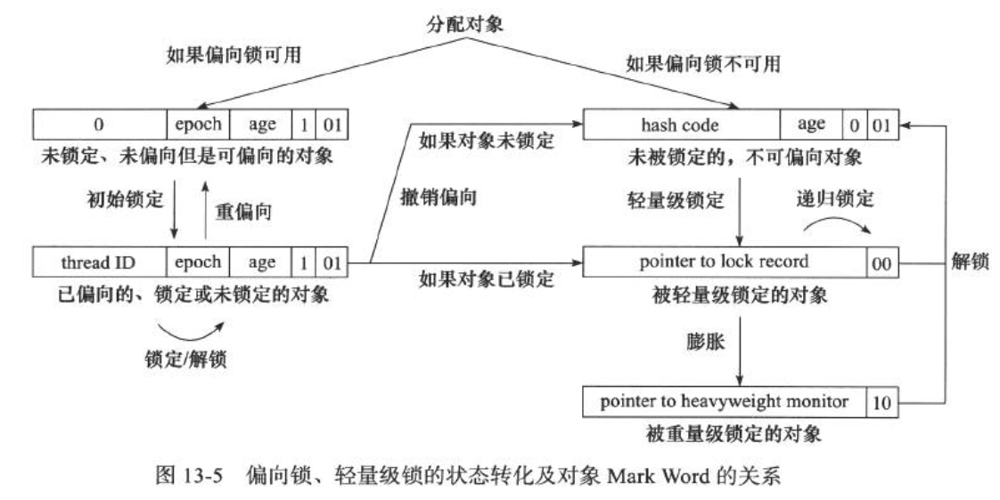

### 锁优化

#### 自旋锁

为了让线程等待，让线程执行一个忙循环(自旋)。需要物理机器有一个以上的处理器。自旋等待虽然避免了线程切换的开销，带它是要占用处理器时间的，所以如果锁被占用的时间很短，自旋等待的效果就会非常好，反之自旋的线程只会白白消耗处理器资源。自旋次数的默认值是10次，可以使用参数-XX:PreBlockSpin来更改。
自适应自旋锁：自旋的时间不再固定，而是由前一次在同一个锁上的自旋时间及锁的拥有者的状态来决定。

#### 锁清除

指虚拟机即时编译器在运行时，对一些代码上要求同步，但是被检测到不可能存在共享数据竞争的锁进行清除(逃逸分析技术：在堆上的所有数据都不会逃逸出去被其它线程访问到，可以把它们当成栈上数据对待)。

#### 锁粗化

如果虚拟机探测到有一串零碎的操作都对同一个对象加锁，将会把加锁同步的范围扩展到整个操作序列的外部。
HotSpot虚拟机的对象的内存布局：对象头(Object Header)分为两部分信息吗，第一部分(Mark Word)用于存储对象自身的运行时数据，另一个部分用于存储指向方法区对象数据类型的指针，如果是数组的话，还会由一个额外的部分用于存储数组的长度。
32位HotSpot虚拟机中对象未被锁定的状态下，Mark Word的32个Bits空间中25位用于存储对象哈希码，4位存储对象分代年龄，2位存储锁标志位，1位固定为0。
|存储内容|标志位|状态|
|---|---|---|
|对象哈希码、对象分代年龄|01|未锁定|
|指向锁记录的指针|00|轻量级锁定|
|指向重量级锁的指针|10|膨胀(重量级锁)|
|空，不记录信息|11|GC标记|
|偏向线程ID，偏向时间戳、对象分代年龄|01|可偏向|

#### 轻量级锁
在代码进入同步块时，如果此同步对象没有被锁定，虚拟机首先将在当前线程的栈帧中建立一个名为锁记录(Lock Record)的空间，用于存储所对象目前的Mark Word的拷贝。然后虚拟机将使用CAS操作尝试将对象的Mark Word更新为执行Lock Record的指针。如果成功，那么这个线程就拥有了该对象的锁。如果更新操作失败，虚拟机首先会检查对象的Mark Word是否指向当前线程的栈帧，如果是就说明当前线程已经拥有了这个对象的锁，否则说明这个对象已经被其它线程抢占。如果有两条以上的线程争用同一个锁，那轻量级锁就不再有效，要膨胀为重量级锁。
解锁过程：如果对象的Mark Word仍然指向着线程的锁记录，那就用CAS操作把对象当前的Mark Word和和线程中复制的Displaced Mark Word替换回来，如果替换成功，整个过程就完成。如果失败，说明有其他线程尝试过获取该锁，那就要在释放锁的同时，唤醒被挂起的线程。
轻量级锁的依据：对于绝大部分的锁，在整个同步周期内都是不存在竞争的。
传统锁(重量级锁)使用操作系统互斥量来实现的。

#### 偏向锁
目的是消除在无竞争情况下的同步原语，进一步提高程序的运行性能。锁会偏向第一个获得它的线程，如果在接下来的执行过程中，该锁没有被其它线程获取，则持有锁的线程将永远不需要再进行同步。
当锁第一次被线程获取的时候，虚拟机将会把对象头中的标志位设为01，同时使用CAS操作把获取到这个锁的线程的ID记录在对象的Mark Word之中，如果成功，持有偏向锁的线程以后每次进入这个锁相关的同步块时，都可以不进行任何同步操作。
当有另一个线程去尝试获取这个锁时，偏向模式就宣告结束。根据所对象目前是否处于被锁定的状态，撤销偏向后恢复到未锁定或轻量级锁定状态。

