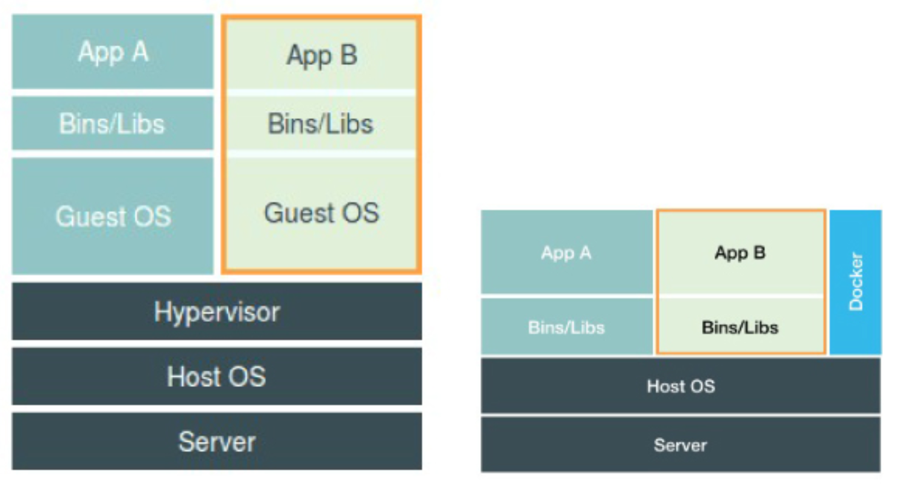

[TOC]

#### docker

##### 容器

是用 clone() 系统调用创建的进程，调用时在namespace参数中指定 CLONE_NEWPID 参数，本质上是一种特殊的进程；

```c++
int pid = clone(main_function, stack_size, CLONE_NEWPID | SIGCHLD, NULL);
```

Linux 操作系统提供了 PID、Mount、UTS、IPC、 Network 和 User 六种namespace


##### docker与虚拟化

谈到为“进程划分一个独立空间”的思想，相信你一定会联想到虚拟机。而且，你应该还看过一 张虚拟机和容器的对比图。



这幅图的左边，画出了虚拟机的工作原理。其中，名为 Hypervisor 的软件是虚拟机最主要的部 分。它通过硬件虚拟化功能，模拟出了运行一个操作系统需要的各种硬件，比如 CPU、内存、 I/O 设备等等。然后，它在这些虚拟的硬件上安装了一个新的操作系统，即 Guest OS。

这样，用户的应用进程就可以运行在这个虚拟的机器中，它能看到的自然也只有 Guest OS 的文 件和目录，以及这个机器里的虚拟设备。这就是为什么虚拟机也能起到将不同的应用进程相互隔 离的作用。

而这幅图的右边，则是应用运行运行在docker的容器内。很多人会把 Docker 项目称为“轻量级”虚拟化技术，实际上就是把虚拟机的概念套在了容器上，这种说法并不准确。用户运行在容器里的应用进程，跟宿主机上的其他进程一样，都由宿主机操作系统统一管理，只不 过这些被隔离的进程拥有额外设置过的 Namespace 参数。而 Docker 项目在这里扮演的角 色，更多的是旁路式的辅助和管理工作。

在理解了 Namespace 的工作方式之后，你就会明白，跟真实存在的虚拟机不同，在使用 Docker 的时候，并没有一个真正的“Docker 容器”运行在宿主机里面。Docker 项目帮助用 户启动的，还是原来的应用进程，只不过在创建这些进程时，Docker 为它们加上了各种各样的 Namespace 参数。


##### docker相较于虚拟化的缺点

主要是隔离不彻底

**首先，既然容器只是运行在宿主机上的一种特殊的进程，那么多个容器之间使用的就还是同一个 宿主机的操作系统内核。**

尽管你可以在容器里通过 Mount Namespace 单独挂载其他不同版本的操作系统文件，比如 CentOS 或者 Ubuntu，但这并不能改变共享宿主机内核的事实。这意味着，如果你要在 Windows 宿主机上运行 Linux 容器，或者在低版本的 Linux 宿主机上运行高版本的 Linux 容 器，都是行不通的。

而相比之下，拥有硬件虚拟化技术和独立 Guest OS 的虚拟机就要方便得多了。最极端的例子 是，Microsoft 的云计算平台 Azure，实际上就是运行在 Windows 服务器集群上的，但这并不 妨碍你在它上面创建各种 Linux 虚拟机出来。

**其次，在 Linux 内核中，有很多资源和对象是不能被 Namespace 化的**，最典型的例子就是: 时间。如果你的容器中的程序使用 settimeofday(2) 系统调用修改了时间，整个宿主机 的时间都会被随之修改，这显然不符合用户的预期。相比于在虚拟机里面可以随便折腾的自由 度，在容器里部署应用的时候，“什么能做，什么不能做”，就是用户必须考虑的一个问题。

此外，由于上述问题，尤其是共享宿主机内核的事实，容器给应用暴露出来的攻击面是相当大 的，应用“越狱”的难度自然也比虚拟机低得多。

更为棘手的是，尽管在实践中我们确实可以使用 Seccomp 等技术，对容器内部发起的所有系统 调用进行过滤和甄别来进行安全加固，但这种方法因为多了一层对系统调用的过滤，一定会拖累 容器的性能。何况，默认情况下，谁也不知道到底该开启哪些系统调用，禁止哪些系统调用。

所以，在生产环境中，没有人敢把运行在物理机上的 Linux 容器直接暴露到公网上。

**另外，容器进程作为宿主机的一个独立的进程，容器内的子进程依然与宿主机的其他进程抢占资源**，容器在资源资源分配上并没有做到完全独立。


##### Namespace 

Namespace 技术实际上修改了应用进程看待整个计算机“视图”，即它的“视线”被操作系统做了限制，只能“看到”某些指定的内容。但对于宿主机来 说，这些被“隔离”了的进程跟其他进程并没有太大区别。


##### Linux Cgroups 

Linux Cgroups的全称是 Linux Control Group。它最主要的作用，就是限制一个进程组能够 使用的资源上限，包括 CPU、内存、磁盘、网络带宽等等。

此外，Cgroups 还能够对进程进行优先级设置、审计，以及将进程挂起和恢复等操作。