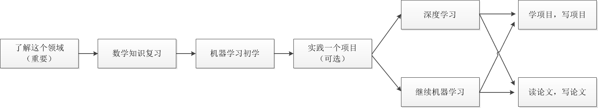
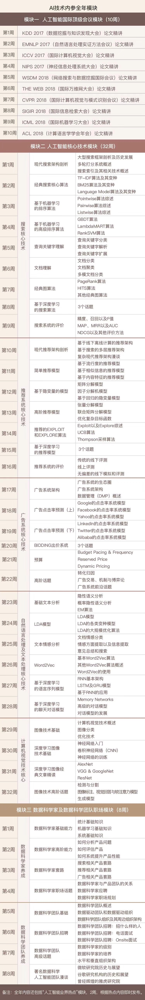

### 人工智能入门

#### 推荐书籍
《模式识别》Sergios
《神经网络》史忠植；
《知识工程语言学》鲁川；
《数据挖掘
《图论》GTM系列之一，Reinhard
《高级人工智能》史忠植；
《知识发现》史忠植；
《智能科学》史忠植；
《人工智能复杂问题求解的结构和策略》Luger；
《人工智能》尼尔森；
《人工智能：一种现代的方法》拉塞尔；
《灵魂机器的时代：当计算机超过人类智能》Kurzwell
《奇点临近》Kurzwell；
《神经网络与机器学习》海金；

### 学习路线

