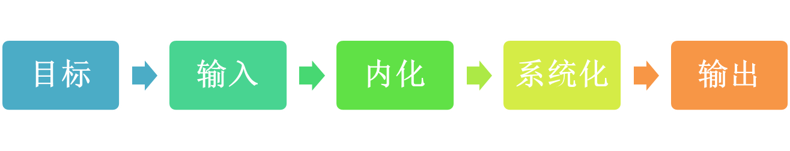

### 一个技术人的知识管理方法论

[TOC]

&emsp;&emsp;本文最早源于一系列关于解决问题方法论的思考,从解决问题的一般原则到探索如何让解决问题依赖知识积累和思维工具而不是偶发灵感.这样关注点逐渐从解决问题演变为个人知识体系的构建和知识的管理。

&emsp;&emsp;2009年 解决问题：心态 原则 方法
&emsp;&emsp;2012年 [Think] 解决问题Ⅱ
&emsp;&emsp;2012年 实用主义的思考与学习读书笔记

&emsp;&emsp;知识管理方法论解决的是效率和效果的问题,其实没有方法论的时候,足够的专注和努力也是可以的,许三多就是这方面的典型代表,他几乎没有什么技巧性的方法,完全是靠执着和努力,这种"傻气"有一个中肯的名字叫做"钝感力".方法论并不意味着能够"空手套白狼",其出发点并不是投机取巧的心理,而是一种自我调整过程中摸索出来一套最优方案组合;这样看个人知识管理方法论有两个特点:

1.不是那么具有普适性,至少不是任何人都能全盘拿过来用

2.方法论是动态的,会根据个人的情况进化

&emsp;&emsp;个人知识管理方法论的关键在于其有效性,所以在不断的进化过程中,一些无效的行为会识别出来进行剪除;比如,我从来不用浏览器收藏,也不会囤积电子书,因为我发现收藏过的文章几乎都不会再看,囤积的电子书就那么一两本会看;对我来说这两件事情用下面的方式是有效的:在Evernote里面有一个"待读"列表,我会逐渐把里面的文章消化掉;电子书要读的,我会放在Kindle里面.下面这张图就是我知识管理方法论的概况:

#### 目标与路线图

&emsp;&emsp;好多人宁可先陷入各种细节中也不愿意去想想自己目标是什么,回避最开始的目标设定环节.翻翻讲时间管理的书,很多时间管理技法的书都是从如何操作开始,而关键的并不是技法,是目标,试想如果没有目标,或者没有想清楚目标,那么使用各种技巧争取来的整块时间用来做什么呢?

&emsp;&emsp;类似的,知识管理也是要从目标设定开始,先确定做事的意义所在,做到什么程度;否则你投入了很多精力在一个领域,你得到你想要的了吗?你达到预期的效果了吗?没法回答!"但行好事,莫问前程","本想顺路打劫,哪想弄假成真"这两种心态说不上坏,但也算不上好;

&emsp;&emsp;设定了目标,就有了目的地,从你现在的位置到目的地怎么完成这段旅程?这就是路线图;

&emsp;&emsp;我们读书的时候,有目录,目录其实就是一本书的路线图;阅读过程中善用目录是学问的,详情请参见<如何阅读一本书>.我们需要拟定一个类似的东西,路线图的好处是,我们在任一时刻都知道自己在什么位置,下一步要到哪里,障碍是什么.有什么方法可以帮我们克服障碍.

&emsp;&emsp;没有目的地的船是无所谓偏离航道的.

#### 输入

&emsp;&emsp;输入有很多方式,或者说有太多的方式,在信息轰炸情况下,获取遴选优质的信息是必备技能;RSS,邮件推送是我最常用的信息获取方式;到目前为止我还是排斥微博,微信这类信息渠道,我发现只要是重要的信息,不上微博也会有其它渠道看到,而微博获取信息的成本太高了,超级碎片化无关联的信息,很难集中精力,所以早早的玩了一阵微博后,就决然退出不玩了;微信也类似,社交网络在信息获取上的特点是你关注了什么人就得到了什么信息,明白了这一点,完全不必拘泥于微博,可以通过RSS之类完成这个过程;对于豆瓣我有两种截然不同的用途,一方面维护了一个Erlang资讯小站,另一方面我关注了一堆和电影,音乐相关的人;因为豆瓣小站和个人主页的时间线有明显产品形式上的区分,所以很容易完成两种状态的切换.还有一点要强调的是:作为一个成熟的人,一定要意识到你在社交媒体上的种种行为对别人来讲是没有多大意义的;

#### 输入过水

&emsp;&emsp;读技术类的书的时候,我都会预测一下,这本书要是我写,我会怎样注水凑字数;开始阅读的时候,就会比较有意识的把注水的部分略过.比如:讲Redis的书注水的方式就是大篇幅讲如何安装,没节操点就把安装输出也打印出来,然后罗列一堆命令,逐一解释;讲大数据的书,就先大篇幅讲大数据发展现状,前景,展望...在图书信息组织上,这种信息无可厚非,逻辑上是说的通的,但,这是你想从书中得到的吗?

#### 高强度的输入过程

&emsp;&emsp;不得不承认的是,在输入的过程中,信息会出现丢失;所以,会有一些高强度的方法来尽可能的减少信息输入过程中的丢失,比如开源项目代码注释版,手敲代码,翻译文章,为代码绘制流程图等等;这些都不轻松,比如翻译文章可以试一下,读一篇技术文章和信达雅的翻译,投入的精力可能差很多.很多人无法理解技术人的这种行为,认为难以理解,我是这样解释的:"作为一个技术人,发现一个好的项目,恨不能把自己也编译到代码里面去".

#### 榨取每一次输入的价值

&emsp;&emsp;我把每一次的输入都当做"线索";买到一本好书的时候我会把这个作者其它的作品也看一下;搜索到一个资料的时候,我会关注一下这个网站,如果是平台就注册一下;如果是Blog就订阅一下RSS,就看看这个博客的主人还关注了哪些人;如果是中文作者,看看他们有没有豆瓣ID,你认可的人读过的书,可能是一个非常好的阅读线索.

#### 自己的错误是最好的输入

&emsp;&emsp;我曾经开玩笑说"小时候把错误较多试卷盖住的孩子,长大后会习惯性Catch所有异常而不处理";自己犯的错误是最佳的输入,这要么是知识盲点,要么是思维缺陷,相比那些已经做得很好的事情,这些错误才真正包含让你更强的信息量.面对错误的那种挫败感和后悔情绪是于事无补的,无任何建设性,"往者不可谏来者犹可追"说的就是这个道理.我第一次看到"破甑不顾"这个成语真心佩服:

>《后汉书·郭泰传》：“客居太原，荷甑堕地，不顾而去。林宗见而问其意，对曰：‘甑已破矣，视之何益。’

#### 内化

&emsp;&emsp;内化,就是有自己的看法,自己的理解;"自己的看法",这个东西在咱们这里挺稀罕,我们被灌输了太多标准化的东西,自己的看法被大大的弱化了;内化就是用自己的思维方式话语方式去描述一个东西,一个比较好玩的例子就是王朔用北京话翻译了一遍<金刚经>和<六祖坛经>.

&emsp;&emsp;内化不是简单记住,知识需要/值得记住的部分是有限的,把可以RTFM从大脑移除,让值得思考的部分留在大脑;

&emsp;&emsp;一本书或者一份资料放在面前,没有必要完全按照现有的结构去接受它,可以进行信息的结构上的重构;这种重构只有一个标准:自己理解起来方便.

#### 多种视角

&emsp;&emsp;从多个视角来观察事物,可以获得更深的印象更好的理解,如果只有一种视角来观察事物,那么看待事物的肯定是片面的;学习同样一种知识也需要多个角度,如果只是一种角度,那最后脱离了这种视角就无法解决问题了;比如,我们熟记TCP/IP相关的各种资料,却不知道在现实中这些参数对应的问题和现象是什么,那么这就是典型的一种维度缺失,只适合用来考试而不是自己掌握的技能;

&emsp;&emsp;关系型数据库实际上是对现实世界的一种抽象方式,不同的抽象方式落实在设计中就是不同的数据表,不同的数据字段;当我们接触一个新知识的时候,书本上给我们只是知识的一个切片,一种抽象而已;避免盲人摸象的尴尬就需要从多个视角去认识同一个事物.

&emsp;&emsp;多种视角实际上是对书本知识的突破,因为书本上通常只提供一两种视角的解读,从多个视角去分析解构知识,能够获得"自己的看法".换句话说,在从多个视角去理解一个知识的时候,实际上完成了知识的内化过程.如果只用一种方式了解一个事物,那你就没有真正理解它.在我们所受的教育中,一个非常的变态的概念就是"标准答案",一个更变态的是"标准过程",前者还只是答案正确即可,后者还要要求过程也正确.横切苹果的案例实际上就是一个事物从不同视角切入时的奇妙景象.

&emsp;&emsp;高中时代有一个事情,一个运算能力超强的同学,在解决物理试卷上往对面扔沙袋,扔多少个对面小车会停住的问题时,没有使用数学归纳发,而是1,2,3,4,5....这样一个个算出来的,算到第21个的时候,得到答案;这个事情留下印象太深了,使用数学归纳法的也未必真正理解其解法的合理性,而这位同学使用了一种自己理解且擅长的方式解出了问题,值得琢磨.

&emsp;&emsp;如何找到多个视角呢?这里有一个工具就是"提问";比如我们现在遇到一个新的东西:Redis,在了解了基本的情况之后,我们可以提出一堆问题:

>Redis和Memcached区别是什么?本质差异在哪里?
>Redis的性能怎么样?和Memcache相比如何?
>Redis安装,部署,使用上有什么需要注意的?
>Redis的数据结构在实际业务场景中有哪些"最佳实践"?
>Redis在NoSQL体系中是怎么分类的?为什么?
>Redis的Bitmap有什么妙用?在以前这些问题是怎么解决的?
>Redis模拟队列和Rabbitmq队列
>........

&emsp;&emsp;这里可以提出的问题太多了,甚至有些问题需要去代码里面寻找答案了.能够提出问题,实际上是强调了"主动性",通过主动思考发现其中的疑问,而不是被动的灌输;一开始通过提问打开多种视角的时候,效果可能非常差,主要是问题问得太水了,只要多练习,特别是针对一种类型的事物反复练习再次遇到同类型的事物基本上条件反射就能提出质量较高的问题.

#### 可复用视角(思考模型)

&emsp;&emsp;同一类事物,我们提出的问题往往是类似的,比如网站系统会考虑页面缓存,静态动态资源分离,SEO优化等等;如果是数据库方案会考虑业务数据的使用情况,数据增长情况,对事务的要求;如果是接口调用,会考虑安全问题,信任问题等等;这些对同一类事物可复用的视角,可以固化下来作为一种思考模型,省得每一次都从头开始想起了,在不断使用过程中思考模型也不断的调整优化;

&emsp;&emsp;我至今难以理解的就是政治课和政治试题,这门课你不能用自己的语言去解答,需要按照书本上的标准描述去回答,因为老师要计算得分点,在快速判卷的情况下,死记硬背标准话语模式是有效的.

#### 系统化

&emsp;&emsp;系统化,实际上就是建立知识点之间的联系,不再孤立,把它融入你的知识体系,说句矫情的话就是"不让一滴水蒸发最好的方法就是把它放入大海".系统化的知识是不容易遗忘的,即使忘掉了,也可以顺藤摸瓜把相关的东西全拎出来;如何做到系统化呢?这里我常用的工具是

##### "画图"

##### "讲故事"

&emsp;&emsp;画图,有两种方式;一种是直接用纸笔画图,纸笔没有什么讲究,随便写,随便画;一种是思维导图工具,思维导图工具用了好多年,在还没有接触过电脑的时候我就开始用思维导图,这也是让我接触电脑后最为惊喜的软件.知识长时间不用必然存在遗忘,不必纠结,我们能做就是留下足够的"线索"或者说是索引,需要的时候有足够的线索唤醒就OK,图形化的内容由于直观简洁且都是按照自己的思路整理出来的,再次进入真的很快.今年在项目中再次用到Storm的时候,我找到了当时的思维导图和笔记,有种热数据瞬间加载的感觉,非常棒.

&emsp;&emsp;讲故事,这也是常用的一个方法,王朔在<致女儿书>里面就是用讲故事的方式把人类进化史和自己家族的历史讲了一遍,也有文章用某种语言设计过程中的趣事八卦串联起来语言的演变过程,这些都是把枯燥的知识有趣化,孤立的知识系统化的好方法.<苏菲的世界><上帝掷骰子吗?>都是这方面的典范;

&emsp;&emsp;讲故事还有一种套路就是跨学科讲故事;高中时候的生物老师是这方面的好手,他经常这样:"在茫茫的草原上,各种动物刚刚渡过了寒冬,一场在幸存者之间的杀戮马上就要开始,同学们想一想这个食物链是怎样的?今天我们要讲的就是食物链.....""李白斗酒诗百篇,白酒经过消化道发生了哪些变化?".就这样天马行空但从不喧宾夺主,这位从不用普通话讲课的老师,给同学们留下无数谈资;我们的生物课成绩也是相当不错;

&emsp;&emsp;我也试过比喻类比之类的方式,发现这种路子开始的时候有效,慢慢就会把我带上歪路;理由很简单,既然是客观上两个截然不同的东西,比喻和类比只能在一定程度上进行,分寸把握不好反而会影响理解.目前对我而言,还在尝试中的方法是TRIZ理论,还不好说效果如何,已经验证行之有效的方法就是画图和讲故事.

&emsp;&emsp;在我们所受的教育中,特别是在面对考试的时候,特别强调的就是"知识点""重点",零散的知识点是经不起时间考验的,好在学校里面通过反复的练习强化,来对抗这个记忆衰退.当我们走出校园,开始在工作中使用掌握的知识的时候,还有重点吗?只要影响你解决问题的都是重点.

#### 重点?知识深度和广度

&emsp;&emsp;重点,是一种非常功利化的概念,是针对考试去讲的,隐含的意思是能够立竿见影有较高的ROI.但实际工作中出现的问题不是XX命题小组搞出来的了,哪里有什么重点.之前和梁同学聊这个问题的时候,我们把知识掌握情况大致划分成下面几种:

>已经掌握的知识,需要解决的问题是抗遗忘
>以为自己掌握而实际未掌握的知识,一旦遇到问题就能发现,及时弥补即可
>知道自己不知道的知识,很简单,意识到短板,弥补即可
>不知道自己不知道的知识,这种是最可怕的,往往会做出错误归因

&emsp;&emsp;特别关注一下最后一点,比如我们在解决某个技术问题时用了很久,表面原因是我们用很久才定位问题,其深层次的原因可能是在于我们对操作系统,对网络知识掌握不扎实,不能够快速的定位或者排除某个可选项;所以我常常和朋友开玩笑说,基础知识是那种平时看没什么用,用到的时候抱不了佛脚的知识,甚至你都意识不到是基础知识缺乏导致的问题,这里的基础知识是不限于计算机领域的.

&emsp;&emsp;知识点之间建立联系,从某个点看,要么是在深度上下功夫,要么是在广度上下功夫;深度层面探究原理,机制,思想;广度方面看应用,看实践;深度和广度两者是互相影响的,这对我们也是一策略调整的机会:深入研究一段时间之后可以透透气看看应用层面的东西,反之亦然.

#### 注意止损

&emsp;&emsp;无论是深度探索还是广度探索,可能在某个点上,我们投入了很多精力却收获很少,ROI很低,边际效益递减;这时候,需要提醒自己适时止损,跳出;可能过一段时间之后,再回头看的时候就会有新的理解了,可以进行下去了.其实这是一种有效避免小巷思维的方法.比如我研究一个开源项目的时候,有一个地方想了两天没明白为什么这样设计,我给自己的截止时间就是两天,然后我就把这个事情挂起了,后来看文档的时候看到了那个设计的解释,豁然开朗.

#### 输出

&emsp;&emsp;掌握知识一定要有输出思维,输出方式可以是在项目中实践,可以是给自己或别人讲清楚,可以是一篇文章或者是一副图,但是无论如何一定要有输出;信息闭塞时代,一招鲜吃遍天和教会徒弟饿死师傅的情况并存,但是网络打破了这种情况,只有分享和思辨才能保持知识的新鲜.我老家所在的村庄有很多做豆腐的,但是只有一家从南方学来了制作"豆腐泡"的工艺,每次做的时候都是大门紧闭,对外人一字不漏;后来接触网络,我在搜索引擎中搜索的前十个问题中就有这个,原来关键在于收水和油温;看,这种知识壁垒,在网络时代是很容易打破的;

&emsp;&emsp;输出最简单的形式就是讲给自己听了,你以为掌握了,开始尝试把这个东西讲出来的时候就颠三倒四,是真掌握了吗?输出给同事,既然是输出给同事,占用别人的时间,如果你提供的信息混乱没有干货,真是罪莫大焉,出于对听众负责的态度也要保证分享内容的质量;输出为一篇博客文章,只要不是涉及商业机密的内容,总是有好处的.刘未鹏之前写过一篇为什么你应该（从现在开始就）写博客,博客也是一种很好的输出方式,具体好处请看原文.

&emsp;&emsp;输出思维一方面强迫我们用主动的和"实用"的标准去认知,一方面通过外界反馈调整;如果没有输出,学了就是学了,连一个检验是否真的懂了的方式都没有,有什么意义呢?

#### 番外篇:PMP的救赎

&emsp;&emsp;要学习知识的结构过于庞杂怎么办?PMP!

&emsp;&emsp;2008年的时候开始自学PMP的课程,后来出现了一个很吊诡的情况是:我翻开PMP的资料看得津津有味,但是一想到考试就兴致全无了.后来发誓再也不把自己主动送到考场,再也不只为考试去学东西.PMP的学习就完全出于好奇和自愿了,对于复杂事情的项目化拆解和运作方法通过长期的浸染,已经形成习惯.现在一些比较庞杂的事情,或者一个比较难的技术公关,我都会按照PMP的路子进行任务拆解,风险评估,里程碑设定.貌似复杂,有doit.im之类的工具协助,其实很容易操作.