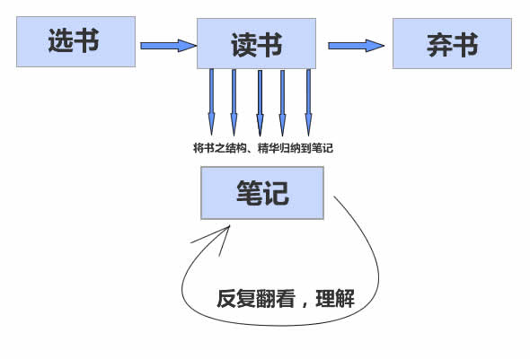

### 到底怎么样才叫看书

[TOC]

#### 一、引入

&emsp;&emsp;看到这个题目的时候你可能会感到有点好笑：“这还用问，看书就是把书看了一遍呗..” 没错，我们从小到大就是这样想的，也是这样看书的，信手拈来一本叫作"书"的东西，从头到尾就开看了！随时年龄的增长，我们的“阅历”也多了起来了，但你是不是也有和我一样的感觉——书是读了不少，真正入脑的，能融入自己思想的内容却少之又少，而且随着年头的增加，你越来越不记得自己读过这些书，更不用提书里到底大概是些什么内容了！这就是我们的长久以来的读书方式。。。 你会不会也这样想，如果我能把我从小到大读过的书都能记下来形成自己的思想，那我现在得多牛啊！是呢，我也常常这样想！于是为了让自己更有思想，就去读更多的书，然后在短短的几年，或者只是几个月，甚至仅仅是几天以后，生活的琐事会渐渐把你关于那些书的缓存挤掉，你的大脑又变成了一块被重新格式化的硬盘，那些书又与你无关了。
&emsp;&emsp;说实话，我曾经就是这种情况，并且被其深深的困扰过，花了大量的时间去阅读，但是在脑子里留下的却是星星点点的零碎的内容，于是很快这些零星的内容也会悄悄的跑掉，剩下的只有一个好笑的自欺欺人的解释——这本书我读过。。。。就这样，我骗了自己二十几年，这二十几年里，不管是教科书，还是小人书，不管是专业书，还是小说，真是读了不少书啊！我花了多少时间在这件事上面呢，少说也有二十年吧，可是，要问我对哪本书的内容真的印象最深的，真的很难回答的出来，更别说去吸取书的精华了。估计和我一样有这样困扰的人肯定很多。你是吗？

#### 二、经历了就能理解

&emsp;&emsp;我经常会想难道我就真的没有从读书中受益过吗？当然有！“咳，咳。。”我要写条sql去数据库里查一下，数据库里垃圾有点多，估计得花点时间，“select * from lifecycle where benefit in reading ——>execute!"  (一分钟。。。二分钟。。。五分钟。。十五分钟过去了，数据终于出来了，垃圾数据把系统性能拖的太慢了，是需要作作调优的时候了)，好了，你很幸运，系统没有宕掉，下面这些数据留给你们参考：
&emsp;&emsp;1、我自认为英语水平还凑合，几次重要的升学考试和就业面试中，都没有在英语这块栽过跟头，由于后来集中学习日语的原因，英语过了CET-6后就很少碰，这个原因我下面会解释。现在很多学生中为英语发愁的不在少数，往往其他各科成绩都很好偏偏英语不能达标，错失了好的升学机会。我回顾自己从小学英语的经历，总有一个点在那闪光，那是我学习英语的转折点。那时是小学四年级，学校刚刚开设英语课，那时和其他的孩子一样，我的英语成绩不怎么样，很吃力。我老爸对我的学习比较严格，当他发现我的英语不行的时候，他开始跟我急了，那时我也真怕他，当老子就是威武啊~ 我爸是高中毕业，他那时的外语水平差不多也就是我四五年级的那个水平的，但是他还是选择了硬顶上来！他拿出课本让我逐句的翻译对话，我还大概记得那对话的内容：
&emsp;&emsp;
&emsp;&emsp;A：what's this?
&emsp;&emsp;B: it's a pen.
&emsp;&emsp;A: what's that?
&emsp;&emsp;B: it's a pencil.
&emsp;&emsp;A: and what's this?
&emsp;&emsp;B: it's a pencilbox.
&emsp;&emsp;A: can you spell it ?
&emsp;&emsp;B: yes.p-e-n-c-i-l-b-o-x,pencilbox.
&emsp;&emsp;A:thank you.
&emsp;&emsp;B:your welcome.
&emsp;&emsp;
&emsp;&emsp;熟悉吧？后来还有很多学者指责我国小学英语教材的落俗套，以致学生跟人对话只会说“what's this” “How are you? fine, thank you. and you?” 之类的，这些我们都暂且不谈。就说我那段时间是怎么被老爸蹂躏的吧。。。
&emsp;&emsp;当时有好多的对话内容我翻译不出来，于是就被无情的鄙视了，并且死规定，以后每天晚上都要默写课文、单词！我那时是真怕他呀，为了应付这一关我是想出了一堆的作蔽手段，小抄、写手上、写桌面上。。都用过了，每天像过堂一样的接受蹂躏，给我幼小的心灵带来沉重的压力，就这么坚持了有多半年。于是，后面的事情你们都猜到了，我的英语成绩上来了，随便找出来一篇课文来我都能熟悉的背出来，得到了来自各方面的肯定和鼓励，回头想想，这都是对心理体验非常好的正能量，直到今天，我都能对英语有信心。现在回想起来，那些小抄的作用就相当于笔记，让我对英语的印象从陌生变熟悉。
&emsp;&emsp;2、高考的经历。对于都经历过高考的人们，这个艰辛的过程我就不再多多描绘了，地球人都知道的。我在这想说的是，在这个备考的过程中对我进步影响最大的一个方面，这也是我高考制胜的法宝。那时我有幸和一名来自山东的转校生(也叫高考移民)同桌，他是我高中时期最好的朋友之一，就是他的学习习惯深深的影响了我，他后来考上了中国公安大学，现在是国家保密机构的人员了，国家机密不多说。他有一个什么习惯呢？作笔记！
&emsp;&emsp;你看到这可能在笑，“原来就是作笔记啊，这谁不知道，谁不作笔记啊”，没错，我们从小都会要求作笔记，有时候我们也会假意的去作一些笔记，但很多的时候是东记一笔，西记一笔，记完就忘了，也找不见了。我说的记笔记不是这种情况。
​&emsp;&emsp;在高考那个大环境下，每天我们都会被大量的习题淹没，多的时候每天要作十几张卷子，那时真是麻木了。我的这个朋友就习惯把每次作完的试卷都从头到尾作个总结，把自己不知道的盲点记在一个本子上，随时翻看。我尝试了这个学习方法后，收效非常大，通过自己的实践也对作笔记有了更深的理解，下面说说我的理解：
&emsp;&emsp;（1）作笔记一定要找个厚点的本子，品质要好，但不要过于花哨的，简约的最好。因为你要能预见，当你养成这个好习惯以后，你遇到什么新的东西都想往上面记几笔，如果页数太少了，你又要换个新本，这样就会对你的知识系统产生分隔，你会更偏向于经常翻看新的本子，旧的本子就被你束之高阁起来了，渐渐那些你曾经领悟的东西又会变的模糊。
&emsp;&emsp;（2）请勿分门别类的记笔记。拿高考这几门课举例，那时我有很多同学的作法是数学一个本，语文一个本，英语一个本，化学一个本。。。 基本上是一门课一个笔记本，分门别类，互不干扰。这样并不是最佳的解决方案。我们俩当时的作法就是所有的内容都记到一个本子上，不分科，新的内容就直接追加到旧的内容的后面，形式上也不要记的太整齐，形式可以多样，圈圈点点，勾勾叉叉，这样更容易在你的大脑里形成再深的印象，我称之为“草稿式笔记”，比条理清晰的“流水式”笔记效果好的多。
​&emsp;&emsp;（3）经常翻看。记笔记其实是对大脑缓存的一个整理，就好比你存在计算机内存里的内容永远是不稳定的，而你一旦写入硬盘，这个安全性就提高了几个数量级（对于程序员的你，道理不解释），同样的道理，你今天对一个问题理解了，但不表明你两天后返回来还能理解到那个程度，最好的办法就是把这个你理解的问题用自己说话的方式记录下来，并且随时翻看，可以说，只要你的这个本子不丢，你就永远能保持对这个问题的新鲜的理解。以至后来，每每月考、期中、期末、摸底的所有考试中，我都只需要拿出笔记本来从头到尾翻看几遍，不再需要看书和资料了，很大程度上增强了我的信心，因为没有记在本子上的对我来说都是“常识”了，所有平时的要点都囊括在了笔记本里面了。如果你身边有面临高考的考生的话，请推荐给他们，这个方法会在高考中给他们很大的帮助。
​&emsp;&emsp;3、学日语的经历。说来比较幸运，有机会能在大学里系统的学习一门二外。能在大学里学习一门外语确实是很有意义的一件事情，因为我们学习英语的战线已经有十几年了，但成果不是太显著，而二外作为一门你有选择的有主动性的去学习的一门语言，如果你肯花心思，进步是很快的。我是从大三开始系统学习日语的，那时刚考完六级，算是完成了阶段性的目标，于是转向日语的学习，洽好赶上学校与某一日企有合作的项目，很幸运的和同专业的几十名同学一起开始学日语，当时是一个中教讲语法，一个日本外教讲口语，因为学时较紧，所以基本上日语课占用了所有专业课之外的所有课时，一周要上20几个课时的日语。这个过程持续了一年多。在这一过程中对我来说受益最大的仍然是大量的笔记。“草稿式笔记”又一次发挥了它的神奇效果，我记了两个厚本子，记录了我整个学习语言的过程，从浅到深，翻翻笔记就能清晰地回忆起自己是怎么一路走过来的。当我有一段时间没有接触日语的时候，如果我想找回一些日语的感觉，我第一选择就是从头到尾的把笔记本看一遍，一遍看完后我仿佛就回到了以前学习日语时的状态，就像计算机一键还原一样，只有笔记能起到这个作用。
&emsp;&emsp;P.S 顺便说明一下我为什么学日语的时候就很少去碰英语的东西。语言这东西学的多了真的是容易混，能精通好几国语言的人真的是值得敬佩，这种敬佩不仅仅是语言学习本身。学了两年的日语以后，口语之类的都练的比较熟悉，因为有外教环境，所以大家平时聊天沟通都得到了很好的锻炼，但是有点作英语面试的时候，我发现了一个很严重的问题，我竟然不能说出一整句表达清楚的英文介绍，每句话都不自觉的往外蹦日语，呵呵，英语的思维完全被日语给抑制住了，于是我发现，这两种语言冲突了，不过为了更好的学日语我就把英语放下了，直到最近的工作需要才再次捡起来，不过还好，把日语先放一放，英语自然就不受影响了。
&emsp;&emsp;
​&emsp;&emsp;4、目前的工作。几个月前换工作到了现在这家外企，外企的宽松的环境和人性化的制度让我很快喜欢上了这里，于是我抱定决心要在这里稳定下来，干出一番事业。从第一天入职我就领到了一个印有公司LOGO的笔记本，现在三个月时间吧，这个本子已经基本用完了。在这个本子上不仅有工作上的事情，meeting,需求讨论，还有大量的读书笔记，内容十分丰富，但都充实的记录了我的每天的轨迹。这本笔记同样比较“草稿”，但我能真正理解它，它就像我的一部分大脑一样，我现在走到哪里都会带着这个本子，班车上、轻轨上有大量的时间，拿出本子就好像和自己在对话一样，无比的踏实与充实。

#### 三、读书要分级

&emsp;&emsp;古人早就说过“开卷有益”，在信息大爆炸的现代社会里，获取知识和信息的方式变的越来越多元化，网络的兴起让知识变的廉价，理想的说一根网线可以得到这个地球上你想知道的一切。请大家和我一起思考一个问题，不论是以什么样的形式，游戏也好，电影也好，看新闻，刷微博也好，我们的最终目的到底是想干什么。我的观点是，所有的这些行为总结起来，终极目的只有一个——获取信息。
​&emsp;&emsp;回想在还没有Internet的时代里，人们主要获取信息的途径就是读书，这是那时的人们能想到的最直接的选择。而今天的我们选择就多了起来，读书看起来好像是最慢的一种获取知识的方式了。但是，选择多了就一定是好事吗？科学家证实（我也不知道哪个科学家），选择越多效率越差，因为这增加了你决策的时间和后悔的理由。先说上网吧，很简单的道理，大家都会经常体验到的，如果你想在网上集中作一件事情，往往是很难的，你会受到来自各个方面的干扰，各种“信息噪声”向你扑面而来，你常常会被另外的“新鲜”信息中断思路，比如QQ右下角讨厌的重大新闻浮动窗。再比如，如果想在电脑上踏下心来看一本PDF版的技术书也是很难的，开始可能还好，看上十页二十页以后，眼酸，想睡，看过什么没太深的印象，想干别的，效率很差，我就是这种情况，对需要用电脑阅读的大段的内容都有抵触的情绪。所以我避免用电脑看一些需要系统理解的东西，因为人有一种心理，就是对于我感到过抵触或厌倦的东西都不想再碰，所以我尽量不用这种方式去触及那些本身应该对我有很大意义的内容，我怕因为一时的不耐烦导致与这些经典失之交臂。 我的习惯作法还是去阅读实体的书，这给人的感觉是完全不一样的，书的厚度是你可以真切感觉到的，而且，看实体书更容易深入内容，这可能因为人类一直以来的习惯都是以书为载体来学习，这促成了人脑的进化，人脑也更习惯这种传统的方式。
​&emsp;&emsp;这部分的标题叫“读书要分级”，什么叫分级呢，就是读书的深度。
​&emsp;&emsp;走进任何一家图书馆，你可能都有冲动要把这里的书全部读掉，可是这显然不现实。
​&emsp;&emsp;电视剧《士兵突击》里许三多在团部的知识问答竞赛时，团长问他是怎么知道这么多知识的，许三多说“我这人笨，不知道应该看什么，我就跑到图书馆，从A开始看，现在才看到D”（大概是这意思，是不是D记不清了）。你说这种人真有吗？有，肯定有，但是这只能是个童话，对于一个现代化的大型图书馆来说，你就是光把A看完这辈子恐怕也不够用的。所以，面对浩瀚的书海，有选择的读一些经典之作才是明智之举。并不是每一本书对于我们的成长都是至关重要的，这里有经典，也充斥着垃圾。如果你花了两年读了一堆垃圾书，这样非但无益，反而会害了你。就像老罗曾经说的，他年轻的时候金庸的武侠小说非常火，很多的个体书商不知名的武侠作者出版的武侠书都署金庸的名，因为那时没有目录嘛，什么“飞雪连天射白鹿， 笑书神侠倚碧鸳”，当时不知道，所以怎么把金庸的书挑出来，很难。
​&emsp;&emsp;那怎么把经典的挑出来呢？这就要借助网络了，豆瓣读书是个不错的地方，这里都是一群爱读书的人，你要看的书在这里基本都能找得到，看过的读者会留下一些感想，如果评价太烂的话，你就应该果断放弃读这本书的想法，因为这可能会浪费你的时间，并且害了你。扯远了，下面开始分级。
​&emsp;&emsp;&emsp;&emsp;第一级：经典中的经典——能奉为经典的著作不多，对于我们计算机这个领域，耳熟能详的经典也就是那一百多本吧，对于读这些书的态度就应该给予足够的重视，记笔记是必须的，因为这些思想需要与你的思想融合起来，形成你的理解，从而发挥经典的作用，因为大部分经典之所以长盛不衰就是因为它们都是授人以渔的。
​&emsp;&emsp;&emsp;&emsp;第二级：技术类专著——这部分就是指那些资深技术专家，或在某个技术领域比较有建树的行业专家写的书，你选择这类书的目的性更强一些，往往是为了更深入的学习一门技术或熟悉一个行业而选择的，这部分你当然也要细读，因为技术的难度你更应该用笔记来梳理思路，形成整个技术的框架，这里面应该包括更多的细节，以助于以后翻阅的时候能理解的更深入。当然，你可以分章节来笔记，这样可以将一个大目标分割成小目标来激励自己去逐项完成。
​&emsp;&emsp;&emsp;&emsp;第三级：技术基础类——有一些书目涉及的是你已经熟悉的技术领域但比较基础的内容，这些书的内容对你的技术水平来说比较基础，但你也不要忽视这样的基础书，这里面可能还有你没有吸收过的精髓也说不定。“温故而知新”，永远不要轻视基础，同样拿出你的本子，翻开新页，标上今天的日期，把这书中讲到的你意识模糊的内容记到你的本子里吧，可能你会发现，你要记的东西还真是不少呢。
​&emsp;&emsp;&emsp;&emsp;第四级：技术周边类——比如《程序员》杂志、技术博客，这一类的资料也不要看过就扔，不要相信你是过目不忘的大师，你大脑的缓存是有限的，你必须要保存到硬盘！所以拿出你的本！
​&emsp;&emsp;&emsp;&emsp;第五级：娱乐类——这部分与你的工作没有直接关系，属于你生活的部分，这部分的智慧更多，但是可能会和技术有冲突，所以如果你需要记笔记，请不要记到你记技术和工作的本子上。

#### 四、只读经典

​&emsp;&emsp;代码真得能改变世界，当然代码也正在改变着世界。程序员的时间是很宝贵的，我们不是这个星球上最聪明的一类人，但我们绝对是最有智慧的一类人。呱唧呱唧~
​&emsp;&emsp;我们花了大量的时间去作需求，去Design,去Coding,去Testing,留给我们自己的时间却总是那么少，除去日常生活起居的时间，陪女朋友的时间，上下班的时间，留下读书的时间就没什么了，哦，对，忘了把你打Dota的时间算里了，这还哪有时间看书啊！！？？
​&emsp;&emsp;当程序员的没有不勤奋的，不勤奋的干不了程序员。所以书还是要看的，怎么看，只读经典。
​&emsp;&emsp;关于什么是经典你自己决定咯，在这个圈里吃饭的，对技术都有很强的敏感性，坏书进不了你的眼，好书也一定逃不掉。

#### 五、别吝惜你动笔的那点时间

​&emsp;&emsp;说了这么多了，你可能已经意识到作笔记的重要性了，其实事实真的是这样。
​&emsp;&emsp;你是否听说过某某大师一生作了几百本的读书笔记这些事，我以前一直有疑惑，他作笔记都是在干嘛呀？都记什么呀，有什么好记的？后来我真正开始作笔记以后，我才真正理解了这件事，原来大师之所以能成为大师，真的都不是一朝一夕的工夫，这需要持之以恒的坚持和坚定，这内心得多强大呀。你要知道，那几百本的笔记不只是笔记本那么简单，那些都是思想的沉淀，思想本来是抽象飘渺的，笔记这种形式让思想有了重量和形态，这种思想被组织，重构，索引，最终印到大脑里形成一座庞大的知识仓库。
​&emsp;&emsp;正所谓磨刀不误砍柴功，记笔记可能会影响你读一本书的速度，但它不会让你白读，如果你读书的目的不是想在你脑子里留下点什么的话还不如去看电视剧，读书就是为了长知识长学问长见识，就是为了将别人好的思想吸取过来，转化成自己的思想体系的一部分，当然，你应该有批判接受这些信息的能力，人云亦云的完全接受也是不合时宜的。
​&emsp;&emsp;我有一个心愿，我渴望能有一天在公交、地铁里看到大家翻看的全是自己的笔记本，而不是一人拿着一部手机在那看着微博还傻笑！

#### 六、再提笔记

&emsp;&emsp;对于《上篇》中所提到的内容，得到了各位博友们的普遍认同我感到很高兴，说实话，从小到大我也就认真作过那几次笔记，但是却都印象深刻，并且对以后的影响也很深远，在走了很多的弯路以后，渐渐才发现这其中的道理来。
&emsp;&emsp;正所谓“学而不思则惘”，学的目的当然不是形式上好看，当然，我们从小受应试教育的影响太深，花了太多的时间和精力去学一些根本用不到的东西，这种“形式”上的学确实也是没有办法。但庆幸的是我们都挺过来了，大学的教育毕竟也是自己完成的，自主性提高了很多，但仍然有很多的在校大学生不清楚自己以后的方向是什么，大学四年里都是迷茫的，等到工作了一年两年以后，才突然顿悟——原来我在大学里浪费这么多宝贵的时光！如果你还是在校研究生，你会发现那些工作几年再回去读研的学生中，学习的自主性和目的性有多强，因为他们已经深深的追悔过那段时光，并且看到了未来努力的方向在哪里。这些道理是一直在学校里的人很难体会的，一切都是“失去了才会珍惜”。
&emsp;&emsp;读书是一个很费时的过程，一本普通的书300多页很正常，软件类的书里1000多页的大部头的著作也很常见。不同于小说是纯叙事性的不需要太多的理解，计算机的书都是需要用大脑去分析和理解的，所以注定了读这些书的速度都不会很快。比如一本300页的书，你用工作之外的时间一共读了7天，实际上到第七天的时候，你对第一天和第二天所读过的东西已经印象模糊了，这时你会意识到这点并立即返回来再看一遍第一天和第二天的东西吗？很多人不会的，人只会更乐意往前看，直到看到最后一页才长嘘一口气，“终于看完了”！ 于是将书放下，即使以后的几天里，书就摆在那你也想不起来再拿起来翻几下。又过了7天，上周读的内容已经完全印象模糊了。又过了一个月，只有书名还能记得。。。
&emsp;&emsp;所以，我们花了大量的时间读书，却效果不大，读了后面的扔了前面的，一遍一遍在重复同样的过程，整个过程里，唯独让我们理解最深的时候，就是在阅读的那个过程当中，那一瞬间的我们对大脑的记忆力保持高度的自信，偏执地认为，将来不论哪个时间，我都将理解到这个程度！事实上，恰恰相反，这只是一个短期的记忆而已，能只维持几天甚至几小时，就像是硬盘一样，你今天删除了一个文件，第二天作数据恢复仍可以找回来，但两个月以后数据恢复就再也找不回来了，因为新的文件已经覆盖了那个位置，记忆的信息被冲掉了。笔记的作用更像是一块移动硬盘，你可以在你认为这文件有用的时候，把它转移到移动硬盘里，即使本机硬盘上的文件被冲掉，你也可以随时读取移动硬盘里的内容。
&emsp;&emsp;你虽然花了时间去读了一本书，但对于这本书可能是你的，也可能不是你的，但如果你对它作了笔记，这本书就百分之百会是你的了。有效读书的过程应该是这样的：

&emsp;&emsp;读书的目的其实最终目的就是形成自己的理解并长期驻存在大脑中，而笔记这个环节是达到这个最终目的最关键的一步。

#### 七、大学课程之授课方法

&emsp;&emsp;大家都经历过大学，我对大学的感悟最大的就是，每一门课学的最明白的时候就是考试之前的那一周。因为有一个考试的期限在那，就逼着自己在那天之前必须得把课本啃完，把内容梳理出来，这大约只需要一周或更少的几天时间，取决于老师哪天通知考试。
&emsp;&emsp;后来我就常常这样想，大学的课程如果是先考试后上课是不是效率会高很多呢？大学生都有很强的自学能力，突击考试的能力都非常强，几天时间把一门从未学过的课考个及格应该问题都不大，这就造成了大家平时上课不用功，只等考试突击的号角吹响才进入学习状态。 如果先考试呢，给大家定个及格线，不及格的算挂科，那大家就会玩命的自学一遍，把考试过掉，这时已经对课程的内容理解的比较深刻了，接下来再从头到尾上一遍课，这就很少会出现有学生因为听不懂而不去听的情况了，大家都会变得愿意听课，并且理解会更进一步，皆大欢喜！可惜啊，大学四年那些课程的价值都为应付考试而大大缩水了。。   

#### 八、我是怎么泡图书馆的

&emsp;&emsp;上大学时看到有人说过一句话,"在学校要好好利用图书馆的资源，等你工作以后哪有这么大的图书馆给你用啊！" 当时对这句话的印象很深刻，但遗憾的是，那时并不会泡图书馆，也没有那么深得意识到图书馆的资源是多么得难能可贵。很多真相都是工作以后才后知后觉的，这其实说明了一个道理，人的认知永远都是只局限于眼前，几年以后回头想想以前的想法只会感到当时是如此幼稚和缺乏思考。
&emsp;&emsp;大家都知道，计算机的书籍一般都比较贵，靠完全买书去提高技术，成本上实在太高。还有一个事实要承认，买来的很多书都想不起来看。在买书时，往往我们都会有一种冲动，并且有一种心理在作祟——我得到了这本书，就学到了这门技术! 于是，在这样的冲动之下，花了很多冤枉钱买了很多书成了摆设，而技术却没有半点长进。
&emsp;&emsp;所以关于买书，我有两点心得和大家分享：
&emsp;&emsp;&emsp;&emsp;1、能不买就不买。 这不是说鼓励大家不读书，反而是为了更有效的读书。古人早就给我们总结了“书非借不能读”，已经是自己的书往往不想读，自认为书就一直在那，我什么时候想读都能读啊，于是一直没有读。而借来的书，因为有期限要还给人家，你就不得不抽出点时间来把它读完，这样才是真的去读了。并且，如果你是按照上面的流程图中画的那样作了笔记的话，这本书你虽然形式上是还了，但你却真正的拥有了这本书，永远的拥有了。
&emsp;&emsp;&emsp;&emsp;2、三思而后买。 如果这本书你周围借不到，你又想读的话，请在买书之前给自己几天时间的准备。准备什么呢？你应该从各个方面了解一下这书的内容，质量，评价等等，并且能列出这书非买不可的几个理由，计划一下你拿到这书后的阅读计划等等。为什么要作这些准备呢，这其实是在强化你读书的动机，动机越强你读书的动力越大，效果也越好，那这本书才不会白读，更不会白买。我给自己的硬性规定是，从我有买书想法的那天起，往后推一周的时间，如果我还是很想买，那就毫不犹豫的出手了！
&emsp;&emsp;&emsp;&emsp;3、买了书赶紧看。当你拿到一本新书的时候，这时是你对这本书兴趣最大的时候，也是最冲动的时候，这时候应该尽量的拿出一大块的时间来把这本书一口气看完，这样能最大程度的激活这本书的价值，而如果一旦搁置下来，下次再翻开它就不一定是什么时候了。“一鼓作气，再而衰，三而竭”，读书也是同样的道理。    
&emsp;&emsp;对我们程序员来说，图书馆仍然是最好的资源，不但全面而且免费，还能既定一个期限督促自己完成学习，一举N得。我是爱泡图书馆的，而且经常是从早泡到晚上关门，有时是看图书馆的书，有时候也只是看自己的书，因为图书馆里环境最能让人心静下来，学习看书的效率都很高。不过，我也常常碰到很多过来看书但是明显是瞎看的读者，这很大程度上还是在浪费时间。举几例：
&emsp;&emsp;&emsp;&emsp;1、没有看书的重点，从书架上一取就是五六本，甚至十几本，这时的心理好像是“我拿的多，看的多，学的多，知道的就多”，其实这是完全自欺欺人的。《上篇》中提到了，一个现代化的图书馆里，你是不可能把每本书都看过来的，你的生命太有限了。像这些取书的人，最后只能是翻翻这个，再翻翻那个，每一本书都不会看超过五分钟，最后原原本本又抱回来了，白白浪费了生命中的几十分钟，却还感到莫名的充实。。。。  我的方式是只取一本，并且这一本一定是我之前在豆瓣上查看过相关评论的，我认为这本书值得去读才去拿来读的，并且，如果这本书真的是好书，是一定要一口气看完的，绝不中途去抓另一本书来看，这会严重的影响理解的连续性。
&emsp;&emsp;&emsp;&emsp;2、小情侣一起来看书的，完全是浪费时间，并且也影响他人。因为两个人一起来的就会有一种“说话有底气”的心理，所以坐在那就会不自觉的聊天说话，而不顾周围人的感受，这样的读者我也很不喜欢。所以如果你想带女朋友一起去泡图书馆，请一定要注意别人的感受，那里不是打情骂俏的地方，你去了目的就是学习，如果有必要可以和女朋友商量分开学习，这样两个人都能充分的利用好在图书馆的那点时间看点东西。
&emsp;&emsp;&emsp;&emsp;3、到图书馆来玩手机的。这部分人很多，抱一堆书过去，然后拿出手机来上网发短信听歌的，也许是把书当成了一种心理安慰。这种人也是不应该出现在图书馆的。 
这其实就是一个动机的问题，动机不纯永远也不可能作到专注。当然，也不能要求人人都有这种专注的性格，也许人家就是来休闲消遣的，没有太多的想法，这也没错。 对于我来说，因为图书馆离住处不是很近，需要花一定的时间成本到达那个地方，所以，我会对在那的每一分钟都比较珍惜，都是自己选择的嘛，总得为自己负点责嘛，所以我一般会将手机关机，并且一直坐到图书馆关门才收拾东西往回走。
